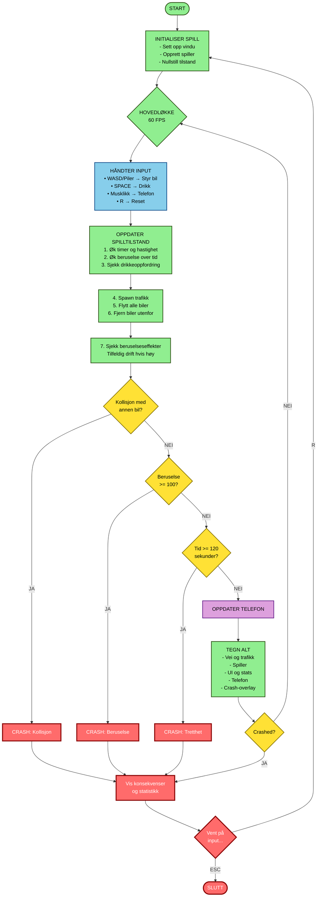
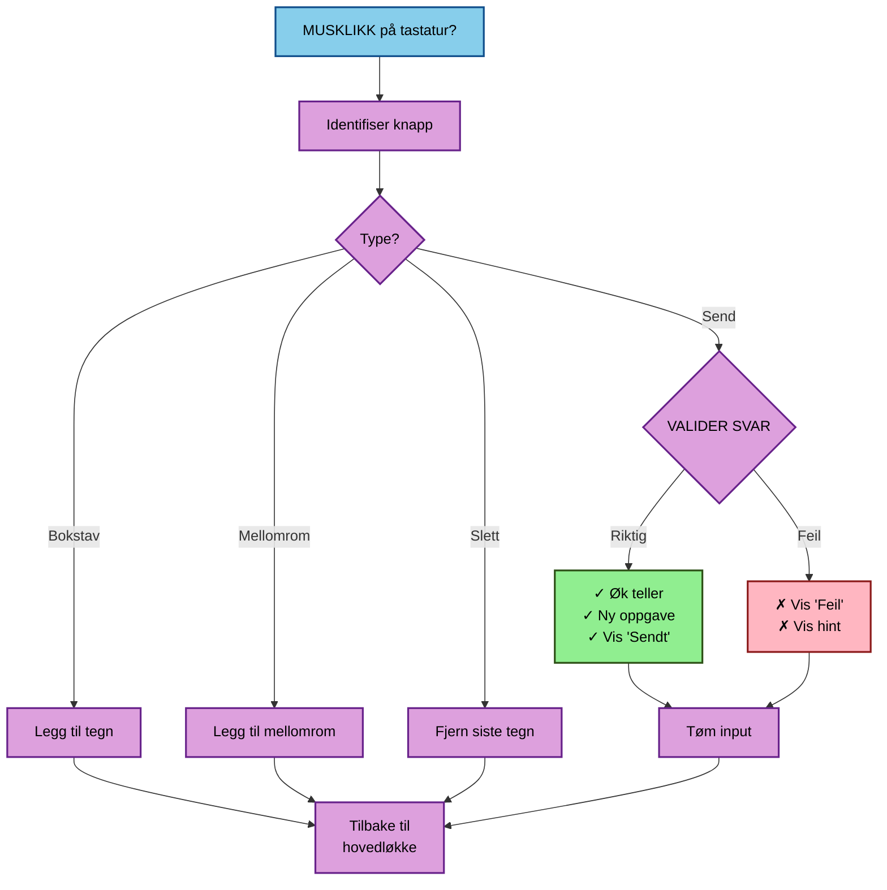
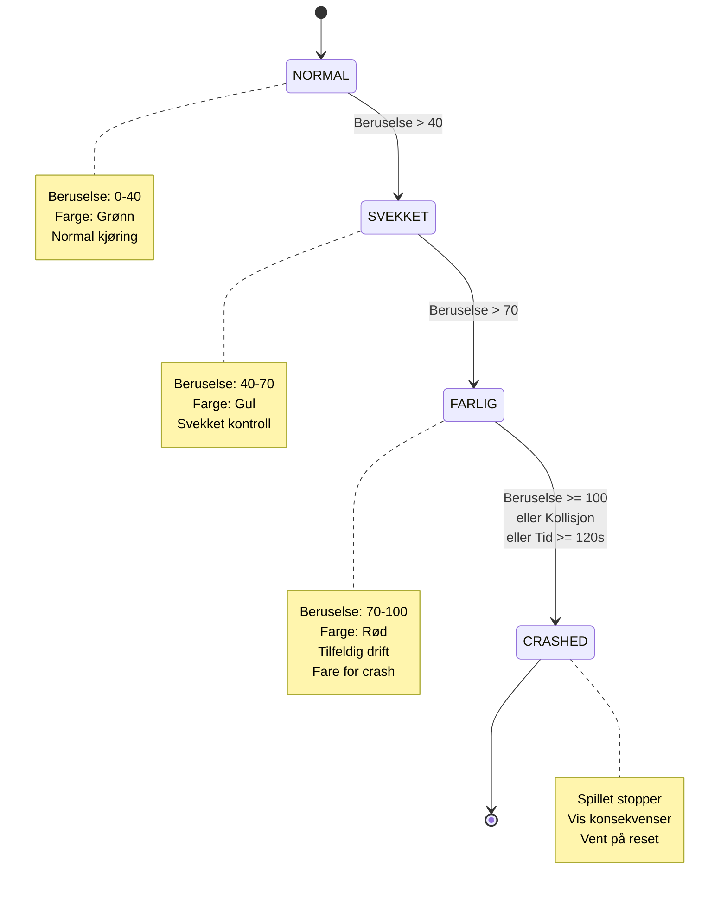

# Mermaid Flytskjema: Dont Drink & Drive & Text

Kopier koden under og lim inn på [mermaid.live](https://mermaid.live) eller i en Markdown-fil med Mermaid-støtte.

---

---

## Telefonsystem (Parallelt subsystem)

---

## Tilstandsdiagram

